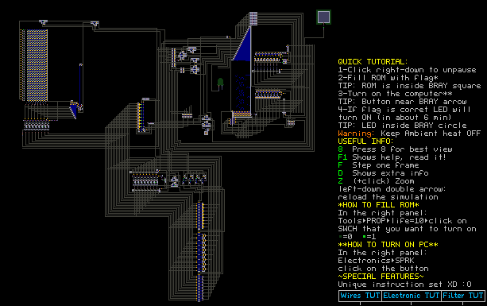

# PoliCTF 2017 - PowderToy CPU  
  
> Why reverse a program when you can reverse a computer & CPU with custom ISA?  
  
TL;DR: Custom homemade CPU  
  
## ~~Program~~ CPU description  
  
  
  
This CPU is a save file of Powder Toy;  
From the [website](http://powdertoy.co.uk/): "The Powder Toy is a free physics sandbox game... The game provides you with various building materials, liquids, gases **and electronic components**"  
  
I have, in a moment of madness ;), decided to build a cpu, painting it by hand pixel after pixel...  
  
Making a cpu is something that was on my "todo list" from some time and this was the perfect opportunity!  
  
Here you can find a document describing the parts, how do they work, the program that it execute, and the flag.  
  
Thanks anyone for playing!  
Greetings from Italy  
Nesos  
